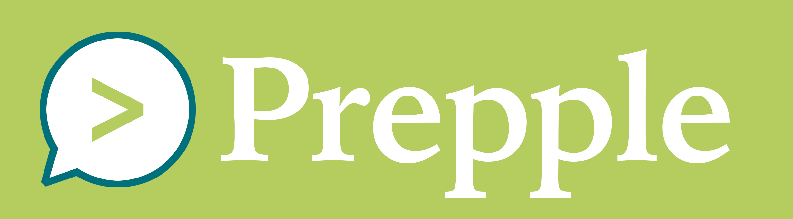

# Prepple - Unlock Your Interview Potential

## Description
Prepple is a web and mobile application in development that helps job seekers unlock their full interview potential through AI-assisted answer planning, virtual interview practice, and social feedback gathering. It includes a number of features to help prepare for virtual and in-person interviews:
* Plan STAR, CARL, or SOAR style responses to behavioral interview questions and receive AI feedback on the content, tone, and clarity of the planned response
* Practice answering behavioral questions 'on camera' and receive AI feedback and suggestions for improvement
* Save practice videos to track improvement over time
* Share videos with friends and mentors and receive feedback and suggestions for improvement
* Create a 'video resume' and promote yourself to recruiters
* Recruiters: discover talented candidates through AI-assisted candidate matching

## Technologies Used
Prepple is a reimagining of MyDevInterview, a quick app I put together during a previous job search. It's built on an AWS and makes use of the following AWS services:
* Code Pipeline
* RDS (PostgreSQL & DocumentDB)
* DynamoDB
* Serverless Lambda
* API Gateways
* Route53 / VPC / VPN
* EC2
* SNS
* Kinesis Streams
* S3 & Glue
* CloudWatch
* Sagemaker
* Cognito Auth

Languages & frameworks in the design plan include:
* AWS CDK + SAM CLI + AWS SDK
* Typescript / Next.js / React
* Java / Spring / Lombok / JUnit / Hibernate
* Ruby on Rails
* Python

## Contact
Jay Clark jay@jayeclark.dev