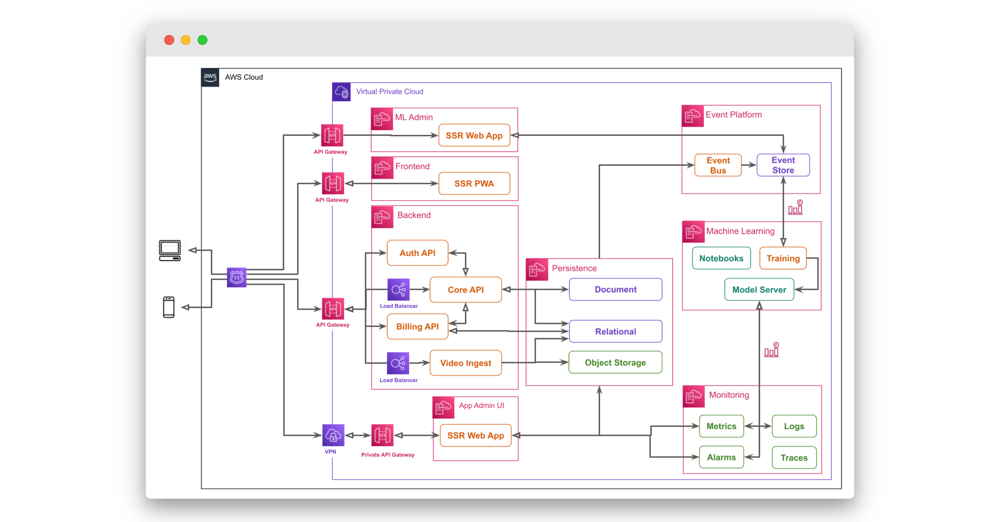

#  Design Doc

## 1 Summary

The purpose of this document is to summarize the design decisions and planned system architecture for Prepple, a behavioral interview prep web application currently in development. 

### 1.1 Background

The interview process at top employers typically involves answering a series of behavioral questions designed to understand the details of a candidate’s behavior in past workplace situations. The motivation behind this approach is the belief that past behavior is the best predictor of future behavior (and therefore of future success on the job.)

During the COVID-19 pandemic, many of these behavioral interviews began to be conducted via video chat. This format can be unnerving for candidates accustomed to in-person or phone-based interviews or candidates who are nervous or uncomfortable on camera.

### 1.2 The Problem

The companies that conduct these behavioral interviews expect answers to be provided in a specific format - typically either STAR, CARL, or SOAR (discussed in detail later in this document). It can be difficult and require some practice to distill a story about a particular experience down to a 2 or 3-minute response, more so for candidates for whom English is not their first language. It can also be challenging to appear natural on camera while answering these questions - in a tight job market, actual interviews are not the place to work out the kinks of your on-camera presence! Often, the only feedback candidates receive on the content and tone of their answers to these questions is the binary output of being offered the job or not.

In the wake of thousands of layoffs in the tech industry, behavioral interview questions have become increasingly important in the hiring process - they are where exceptional candidates stand out.

### 1.3 Current Landscape

There are many online resources related to behavioral interview questions. Dozens of websites provide sample behavioral interview questions and advice on how to answer them. Some also identify which questions are used most frequently by specific companies.

However, few of these offer interactive tools for planning and practicing responses. LinkedIn has a feature where candidates can practice responding to prompts and get AI and network feedback on their delivery, but there are no interactive planning tools, no way to track progress over time or compare different versions of an answer, and no way to connect with specific feedback providers for paid micro-mentoring.  Standout provides options to practice and receive AI feedback but doesn’t include productivity tools for planning answers, or the ability to share responses with friends and mentors for human feedback, and costs $29/month for job seekers. Companies like Interview Kickstart offer some amount of planning support, and live feedback through mock interviews, but don’t provide resources for candidates to track their progress, review past answers, or get feedback from sources outside the program. Not everyone can afford to commit $5K, either!

As a job seeker, I could plan using the tools available to me on my laptop, storing answers in a Google Doc, and I could practice by recording videos locally with my camera, but this basic approach doesn't provide me with immediate feedback on tone and content. It also adds additional work - I need to find my own questions and plan my own practice runs. And I don’t have an easy way to share videos with friends or potential employers.

None of the available resources adequately address the three core needs of job seekers with regard to behavioral interviewing: help & motivation with planning answers, a platform to practice answers and receive immediate feedback, and a way to workshop answers to friends & mentors for feedback.

## 2 The Platform

Prepple is a social platform for planning, practicing, and sharing responses to behavioral interview questions. In this section, we’ll cover the different users of the platform, the stories that drive them to use it, general system architecture, and the detailed functional and non-functional requirements of the platform. This is a living document, so these details may all change in the future, but they represent the current understanding of the platform and the current jumping-off point for establishing development milestones and project plans.

### 2.1 Users

#### 2.1.1 Job Seekers

In the U.S. alone, around 6 million people are currently looking for office-based jobs. They’ll search on average 5 months before finding their next role. There’s an 86% chance that their interview process will be conducted remotely, and a 75% chance that the interview process will include behavioral questions. They will likely turn to a variety of interview preparation resources during their search, which vary by industry. In the software development industry, for example, job seekers might use online sites like LeetCode and HackerRank, which offer premium interview prep plans. They might also turn to a personalized interview coaching service, which can cost anywhere from $500 to $5,000! Although 94% of candidates want to receive feedback on their interviews, fewer than 41% actually receive it. Few statistics are available on the interview preparation market, but it’s likely to be sized similarly to the market for online coding bootcamps - both are niches within the $319B online education market. Coding bootcamps attract the small percent of the population attempting to transition into entry-level roles in the tech industry, while interview preparation tends to have a smaller per-person spend, but applies to a much broader range of industries and career levels. In 2021, the online coding bootcamp market was valued at $1.13B and is expected to grow to $3.66B by 2027.

The average Prepple user is a college-educated individual in their mid-20s to mid-30s who is working to find employment that aligns with their career goals. They have a range of skills and qualifications that make them attractive to potential employers, including strong communication skills, technical expertise, and a proactive problem-solving approach, but they also know that to put their best foot forward in an interview, they need to do some preparation and practice first. They are actively engaged in networking to find job openings, using a range of different options - online job boards, social media, and recruitment agencies. They may face challenges during their job search, such as competition for available positions, lack of job openings in their desired field, or discriminatory hiring practices, which have driven them to Prepple in order to help them stand out more in their behavioral interviews. 

#### 2.1.2 Recruiters & HR Professionals

While Prepple is primarily oriented toward job seekers, recruiters & HR professionals are another category of users who may interact with the platform. There are more than 250,000 recruiters in the US alone, and attracting the right candidates is one of the toughest challenges they face. Recruiters can use Prepple to get a better sense of specific candidates’ personalities and backgrounds, or they can submit job requisition details and browse candidates whose video resumes specifically match the tone, culture, and experience outlined in the job description.

#### 2.1.3 Feedback Providers

One of the most important aspects of Prepple is the ability for job seekers to get feedback from members of their personal networks, not just from AI. A large number of feedback providers will interact with Prepple via its social sharing features. Some of these may convert to mentors on the platform, actively posting example answers to behavioral interview questions and offering paid mentoring and feedback sessions for premium users.

#### 2.1.4 Internal Users

A number of internal users associated with Prepple will need to interact with the platform in order to moderate content and user behavior, investigate customer service issues, and handle billing issues. While ideally the majority of the CX will be automated, individual administrative users are still needed to make judgment calls about questionable content or actions that violate terms of service, or handle unusual billing and administrative issues.

### 2.2 User Stories

To learn more about how Prepple works, let’s dive into some archetypical user stories. After covering the three core groups of end users, we’ll also discuss some of the user stories internal to the platform, such as community moderation, customer service, and billing admin.

#### 2.2.1 Job Seekers

As a job seeker, I want to…

- register for an account in order to access the features of the platform
- preview certain practice and planning features without creating an account or logging in
- easily discover behavioral interview questions that I might encounter in an upcoming interview - either in general, related to a specific cultural value, or related to a specific company.
- have an easy way to start planning how I can answer certain behavioral questions in a STAR, CARL, or SOAR format, and a way to quickly locate the answers I’ve planned.
- track my progress toward completing the planning stage of my preparation
- receive AI feedback on the answers as I plan them, including how ‘listenable’ my script or bullet points are and how well they fit the intended tone and topic.
- get guidance or prompts if I’m having trouble thinking of a way to answer a question
- see sample responses from others who have made their responses public or are on the platform as mentors
- receive automated feedback on whether my response is too generic or too similar to other users’
- have the platform create a sample planning & practice schedule for me, allow me to modify the schedule, and send me reminders as needed to help me stick to that schedule
- record myself answering behavioral interview questions, and save the recordings I like
- receive AI feedback on the recorded video transcript
- practice answering questions with different levels of ‘cheat sheet’ (full script, bullet points, or no assistance.)
- track my improvement over time both qualitatively and quantitatively
- share answers and sets of answers with friends, mentors, and/or the general Prepple community for feedback
- easily assemble my favorite responses into an interactive video resume that I can use to promote myself to potential employers
- pay for focused feedback from qualified mentors on the platform and rate the quality of that feedback
- be able to subscribe for added benefits like advanced ai analysis, larger storage and publication limits, and unlimited interactive video resumes

#### 2.2.2 Recruiters

As a recruiter, I want to…

- get to know candidates better before or after completing a phone screen by viewing their answers to behavioral questions that they’ve selected to best highlight their skills
- be able to subscribe as a premium user in order to discover candidates on the platform whose video resumes match the cultural values and soft skills of the role I’m recruiting
- check for plagiarism or ‘experience theft’ and know that the videos I am viewing are likely to represent the candidate’s true experiences
- receive AI insights about the candidate’s personality based on their responses, if the candidate agrees to make that information public
- provide feedback to candidates who indicate they are open to feedback

#### 2.2.3 Feedback Providers

As a feedback provider, I want to…

- view an answer video or set of videos and quickly provide feedback on the response
- provide feedback on the ai evaluation of the answer to help improve the platform’s model
- register as a paid mentor on the platform
- record example answers to behavioral questions to help others learn
- connect with job seekers for short, paid micro-mentoring sessions to help them improve their answers
- manage my availability and visibility for paid micro-mentoring
- manage my payout methods and frequency

#### 2.2.4 Moderators

As a moderator on the platform, I want to…

- quickly and proactively identify, via a dashboard, users who may be engaging in toxic or inappropriate behavior on the platform
- view user reports of inappropriate behavior
- investigate flagged accounts and take appropriate action
- escalate cases when needed

#### 2.2.5 Customer Service & Billing

As a customer service representative on the platform, I want to…

- receive customer support tickets
- investigate the circumstances of the ticket
- rocess refunds and resolve other billing issues
- assist customers with account recovery issues
- escalate tickets to GitHub issues as needed

### 2.3 Guiding Principles

Guiding principles can help with decisionmaking by providing a reference point to evaluate different options. I like to include a few to remind the team of the driving philosophy that should be behind the design. (Here there's no team yet, but I'm including them for my own reference to keep me on track. Working on a project while job hunting, it's tempting to try to 'show off' and add unnecessary complexity to a project, so most of my guiding principles here are focused on keeping me focused on the goal: turning my earlier proof-of-concept into a platform that provides value to fellow job seekers.)

#### 2.3.1 Plan Big, Start Small

Plan for scalability and a plan to scale, but start with a system sized to the expected initial user base. Add convenient configuration options that allow for assorted configuration options to automatically be 'turned on' if/as needed. Develop through small, immediately-testable iterations behind feature flags.  Create contingency plans to address known and unknown obstacles based on observed solutions and solution times to past challenges.

#### 2.3.2 Simplify the Wheel, Don't Reinvent It

It's easy to get caught up in trying to create everything from scratch or demonstrate a new approach to an old problem, especially on personal projects where one has carte blanche on design decisions. This approach can lead to wasted time and resources, as well as potential security vulnerabilities. Design decisions for Prepple should be focused mainly on simplifying tried-and-true architecture configurations, design patterns, and frameworks - not attempting to create new ones.

#### 2.3.3 Prioritize Customer Value over Income

The costs for running Prepple are anticipated to be relatively low. Design decisions should prioritize the experience of the primary customers of Prepple (non-subscribing users.) Efforts to improve monetization, such as through machine learning analysis of conversion behaviors, should take a back seat to efforts that improve the overall experience and value of the platform.

#### 2.3.4 Make Architecture Decisions Based on Data

At this stage, most of the load and latency calculations are hypothetical and highly contingent. The design for Prepple should establish a procedure for setting and monitoring metrics that will enable data-driven decisions on when to make scalability, reliability, or availability upgrades to the existing architecture. Known potential bottlenecks, as well as areas assumed *not* to be bottlenecks, should be tracked and validated through load testing in advance of deployment to production.

### 2.4 Load Calculations and Potential Bottlenecks

One of the biggest concerns in designing a platform like this is not just ‘will it scale’, but ‘what might it have to scale to?’ and ‘what will it cost me to run the project at X scale?’  Let’s run sample calculations on three scenarios:

- **Niche:** Prepple stays a hobby project but attracts a small group of regular users. In this scenario, we have 500 registered users, 2,000 app sessions per month, and max 25 concurrent users.
- **Side Hustle:** a moderate success story where Prepple becomes a reasonable side business with tens of thousands of registered users. Expect 50,000 registered users, 200,000 app sessions per month, and a max of 2,500 concurrent users.
- **Viral Success:** a blue sky scenario where Prepple catches on like wildfire and becomes the LeetCode of behavioral interview preparation. This would equate to 5M registered users, 20M app sessions per month, and a whopping 250,000 peak concurrent users.

There are a few areas where we need to consider whether bottlenecks will occur at scale. Running load and TPS calculations for each of these can be helpful in understanding when scalability begins to be an issue. In addition, since the architecture for Prepple is all Cloud-based (where costs are notorious for creeping up) this process can help forecast costs and make sure they’re in line with expectations. 

We’ll revisit these calculations as development proceeds, but for now, it appears that scalability concerns become a serious issue when approaching the third scenario (as expected.) We’ll design the system so that it can operate at the smaller ‘Niche’ and ‘Side Hustle’ scopes but scale as needed if the platform grows.

**Table 1. Load Estimates**   
(Numbers are for peak use unless otherwise indicated)
<table>
  <thead>
    <tr>
      <td><strong>Area</strong></td>
      <td><strong>Assumptions</strong></td>
      <td><strong>Niche</strong></td>
      <td><strong>Side Hustle</strong></td>
      <td><strong>Viral Success</strong></td>
    </tr>
  </thead>
  <tbody>
    <tr>
      <td>Core Api</td>
      <td>Planning & practicing involves 20-30 API calls per minute due to video ingest & telemetry (though the I/O for them will be split among Postgres, DocumentDB, S3, and DynamoDB.) Some of these, especially events, could be moved to take place through a websocket connection, but let’s leave them in this calculation for now.</td>
      <td><em>Peak:</em> 1-2&nbsp;TPS  <em>Average:</em> &lt;1&nbsp;TPS</td>
      <td><em>Peak:</em> 100-150&nbsp;TPS  <em>Average:</em> &lt;6-10&nbsp;PS</td>
      <td><em>Peak:</em> 10K-15K&nbsp;TPS  <em>Average:</em> &lt;600-1K&nbsp;TPS</td>
    </tr>
    <tr>
      <td>Auth Api</td>
      <td>Will be used as frequently as the Core API to confirm auth status of user tokens, plus additional use for registration and password resets (+5% of core API usage), however there will also be a DDB cache for authed users which can reduce the load by ~95%.</td>
      <td>&lt;1&nbsp;TPS</td>
      <td>5-8&nbsp;TPS</td>
      <td>500-750&nbsp;TPS</td>
    </tr>
    <tr>
      <td>Billing API</td>
      <td>Used infrequently, max 5% of visits</td>
      <td>&lt;1&nbsp;TPS</td>
      <td>&lt;1&nbsp;TPS</td>
      <td>5-8&nbsp;TPS</td>
    </tr>
    <tr>
      <td>Relational DB I/O</td>
      <td>Planning & practicing both involve 2-3 transactions per minute since most of the work happens on the client side. Rating & recruiting involves 10-20. We assume 90% of the app volume is practice & planning.</td>
      <td><em>Peak:</em> &lt;1&nbsp;TPS  <em>Average:</em> &lt;1&nbsp;TPM</td>
      <td><em>Peak:</em> 1-23&nbsp;TPS  <em>Average:</em> 1-2&nbsp;TPS</td>
      <td><em>Peak:</em> 1.5K-2.3K&nbsp;TPS  <em>Average:</em> 80-150&nbsp;TPS</td>
    </tr>
    <tr>
      <td>Document DB I/O</td>
      <td>Planning involves 4-5 transactions per minute. Assume (⅓ * 90%) of users are planning.</td>
      <td>&lt;1&nbsp;TPS</td>
      <td>20-40&nbsp;TPS</td>
      <td>2K-4K&nbsp;TPS</td>
    </tr>
    <tr>
      <td>Video Ingest & Processing API</td>
      <td>20 minutes of video per 30-minute session. For 1080p/60FPS this would be 900 MB per session or around 0.75 MB per second. Assume (⅔ * 90%)of job seekers are practicing with videos.</td>
      <td>0.1-0.3&nbsp;MB/s</td>
      <td>4-5&nbsp;MB/s</td>
      <td>300-400&nbsp;MB/s</td>
    </tr>
    <tr>
      <td>Event Persistence Layer</td>
      <td>Assume that all I/O events are sent to the platform, plus 1 event per 10 seconds per user session.
</td>
      <td>2-3&nbsp;per&nbsp;sec</td>
      <td>150-200&nbsp;per&nbsp;sec</td>
      <td>15-20K&nbsp;per&nbsp;sec</td>
    </tr>
    <tr>
      <td>Video Storage (Per Month)</td>
      <td>No limits on storage per user. ⅔ * 90% of visitors * 20 minutes recording * ⅔ saved.
</td>
      <td><em>Raw:</em> 20-27&nbsp;GB/mo  <em>Compressed:</em> 2-3&nbsp;GB/mo</td>
      <td><em>Raw:</em> 2-3&nbsp;TB/mo  <em>Compressed:</em> 200-300&nbsp;GB/mo</td>
      <td><em>Raw:</em> 200-270&nbsp;TB/mo  <em>Compressed:</em> 20-27&nbsp;TB/mo</td>
    </tr>
    <tr>
      <td>Video Storage (Total Year 1)</td>
      <td>Assume worst case scenario (steady growth month over month and no deletion of old videos)</td>
      <td><em>Raw:</em> $33-$45  <em>Compressed:</em> $3-$4</td>
      <td><em>Raw:</em> $3.4K-$4.5K  <em>Compressed:</em> $340-$450</td>
      <td><em>Raw:</em> $343K-$463K  <em>Compressed:</em> $34K-$46K</td>
    </tr>
  </tbody>
</table>

#### 2.4.1 Notes on Bottlenecks

We can see a few areas of concern from this chart, mostly in ‘Viral Success’ scenario. Core API calls are fairly high, meaning that an application load balance and multiple instances of the API server will likely be needed. Document database and relational database transactions are both fairly high, indicating a need for read replicas or clustering. (At the point that a single database instance is handling 5M registered users, sharding & partitioning becomes an important consideration too.)

Video storage costs are significant at higher levels of usage, as is ingest bandwidth. We’ll need to do further calculations and design work to determine what kinds of trade-offs are acceptable here in terms of when, where & how video footage is compressed for transmission & storage.

#### 2.4.2. Calculations to Revisit

For now, these calculations are sufficient to highlight the areas where scalability may become an issue, and the areas it will likely not. We’ll revisit some of these calculations in the future. The one that seems the most potentially off is the event platform message rate. Assumptions about just how many events may be generated from user activity on the platform may  (SQS queues are limited to 3,000 messages processed per second.)

### 2.5 Planned System Design

#### High-Level Overview

The current working plan is to organize the platform architecture into four groups of resources:

1. a core web app consisting of a front end, a backend middleware layer, a persistence layer, and monitoring stack
2. an administrative web app for customer service, user safety, and content moderation
3. an event platform (event bus + event store) that can help the core web app scale by decoupling follow-on actions from the API events that trigger them.
4. a machine learning application consisting of a model training stack that interacts with the event platform, persistence layer & monitoring stacks (to trigger alarms related to model drift), and an administrative/debugging UI.

The middleware layer is organized into four services: a core API handling standard CRUD transactions for the persistence layer, auth API, billing API, and a video ingest API that processes practice videos for storage and analysis. 

